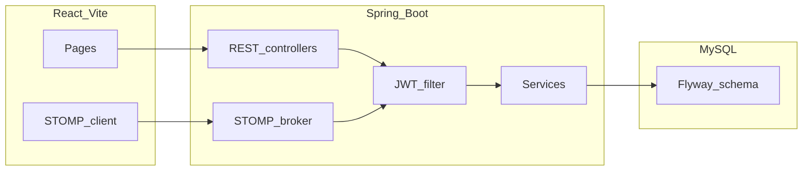

# Architecture

## Layers

## Responsibilities

- **REST:** Auth, CRUD, browse/search, thread list, paginated message history, “open thread” actions, REST send message (also broadcasts on STOMP topic).
- **WebSocket:** SockJS endpoint `/ws`; STOMP destinations: subscribe `/topic/threads.{threadId}`; app prefix `/app`; send `/app/chat.send` with JSON `{ threadId, body }`.
- **Threads:** One row per conversation; `type` = `MATCH` | `LISTING` | `ADOPTION`; participants stored as ordered user ids (`participant_one_id` < `participant_two_id` convention in code where applicable).

## Security

- HTTP: JWT bearer filter loads `User` by id from token subject.
- WS: `JwtHandshakeInterceptor` reads `access_token` query param; `StompUserChannelInterceptor` sets `Principal` on `CONNECT` (session attribute or `access_token` header).
